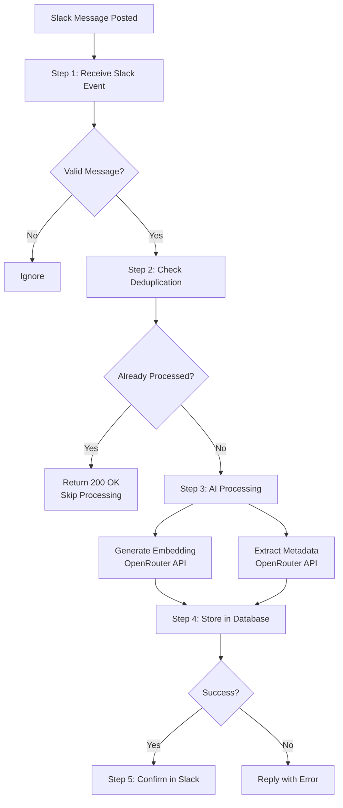
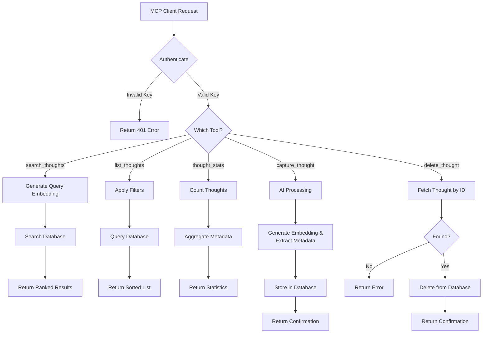

# Supabase Edge Functions - Open Brain

This directory contains Edge Functions that power the Open Brain system for capturing and managing thoughts.

## Functions Overview

### 1. ingest-thought
**Purpose**: Automatically captures thoughts from Slack messages and stores them in the database with AI-generated metadata.

### 2. open-brain-mcp
**Purpose**: Provides an MCP (Model Context Protocol) server that allows AI assistants to interact with your thought database.

---

## ingest-thought

### What It Does
Listens for messages in a specific Slack channel and automatically converts them into structured thoughts stored in your database.

### Environment Variables Required
- `SUPABASE_URL` - Your Supabase project URL
- `SUPABASE_SERVICE_ROLE_KEY` - Service role key for database access
- `OPENROUTER_API_KEY` - API key for OpenRouter (used for AI processing)
- `SLACK_BOT_TOKEN` - Slack bot token for posting replies
- `SLACK_CAPTURE_CHANNEL` - The specific Slack channel ID to monitor

### Process Flow



**Step 1: Receive Slack Event**
- Slack sends a webhook when a message is posted
- Function validates it's from the correct channel
- Filters out bot messages and message edits
- Extracts the message text

**Step 2: Check Deduplication**
- Queries database to check if a thought with this Slack message timestamp (`slack_ts`) already exists
- If found: Returns 200 OK immediately and skips all processing
- If not found: Proceeds to Step 3
- **Purpose**: Prevents duplicate thoughts when Slack retries the webhook due to slow response times

**Step 3: AI Processing (Parallel)**
Two AI operations happen simultaneously:

a) **Generate Embedding** (via OpenRouter)
- Sends message text to `text-embedding-3-large` model with 3072 dimensions
- Receives back a vector representation (array of numbers)
- This enables semantic search later

b) **Extract Metadata** (via OpenRouter)
- Sends message text to `gpt-4o-mini` model
- AI analyzes the message and extracts:
  - **People**: Names mentioned in the message
  - **Action items**: Any implied to-dos
  - **Dates**: Any dates mentioned (YYYY-MM-DD format)
  - **Topics**: 1-3 relevant topic tags
  - **Type**: Categorizes as observation, task, idea, reference, or person_note

**Step 4: Store in Database**
- Inserts into `thoughts` table with:
  - Original message content
  - Vector embedding
  - Extracted metadata
  - Source marked as "slack"
  - Slack message timestamp

**Step 5: Confirm in Slack**
- Posts a threaded reply to the original message
- Shows what was captured (type, topics, people, action items)
- If storage fails, replies with error message

### External Services Used
- **Slack API** (`chat.postMessage`) - For posting confirmation replies
- **OpenRouter API** - For AI processing:
  - Embeddings endpoint - Creates vector representation
  - Chat completions endpoint - Extracts structured metadata

### Expected Behavior
- Only processes messages in the designated channel
- Ignores bot messages and edits
- Processes each message once
- Always replies in thread with confirmation or error

---

## open-brain-mcp

### What It Does
Runs an MCP server that exposes your thought database to AI assistants, allowing them to search, list, capture, and delete thoughts on your behalf.

### Environment Variables Required
- `SUPABASE_URL` - Your Supabase project URL
- `SUPABASE_SERVICE_ROLE_KEY` - Service role key for database access
- `OPENROUTER_API_KEY` - API key for OpenRouter (used for embeddings and metadata extraction)
- `MCP_ACCESS_KEY` - Secret key to authenticate MCP client connections

### Process Flow



### Available Tools

#### 1. search_thoughts
**What it does**: Semantic search across your thoughts

**Process**:
1. Receives search query from AI assistant
2. Generates embedding for the query (via OpenRouter)
3. Calls database function `match_thoughts` with the query embedding
4. Database returns thoughts ranked by similarity
5. Formats and returns results with metadata

#### 2. list_thoughts
**What it does**: Lists recent thoughts with optional filters

**Process**:
1. Receives filter criteria (type, topic, person, date range, limit)
2. Queries `thoughts` table with filters applied
3. Orders by creation date (newest first)
4. Returns formatted list with metadata

#### 3. thought_stats
**What it does**: Provides overview statistics of all thoughts

**Process**:
1. Counts total thoughts in database
2. Fetches all thought metadata
3. Aggregates statistics:
   - Count by type
   - Top 10 topics
   - People mentioned
   - Date range
4. Returns formatted summary

#### 4. capture_thought
**What it does**: Saves a new thought (same as Slack ingestion but triggered manually)

**Process**:
1. Receives thought content from AI assistant
2. **AI Processing (Parallel)**:
   - Generates embedding (via OpenRouter)
   - Extracts metadata (via OpenRouter)
3. Inserts into `thoughts` table with source marked as "mcp"
4. Returns confirmation with extracted metadata

#### 5. delete_thought
**What it does**: Removes a specific thought by ID

**Process**:
1. Receives thought ID from AI assistant
2. Fetches the thought to verify it exists
3. If found, deletes it from database
4. Returns confirmation with preview of deleted content
5. If not found, returns error

### Authentication
- Every request must include access key via:
  - HTTP header: `x-brain-key`
  - OR URL parameter: `?key=YOUR_KEY`
- Requests without valid key receive 401 error

### External Services Used
- **OpenRouter API** - For AI processing:
  - Embeddings endpoint - Creates vector representations for search and capture
  - Chat completions endpoint - Extracts structured metadata when capturing

### Expected Behavior
- MCP server runs continuously, waiting for client connections
- Each tool call is independent
- Authentication is required for all operations
- Errors are returned to the AI assistant with descriptive messages

---

## Common Components

Both functions share the same AI processing logic:

### Embedding Generation
- Uses OpenAI's `text-embedding-3-large` model via OpenRouter
- Converts text into 3072-dimensional vector
- **Important**: The `dimensions: 3072` parameter must be explicitly specified in the API request
- Enables semantic similarity search with higher quality embeddings

### Metadata Extraction
- Uses OpenAI's `gpt-4o-mini` model via OpenRouter
- Analyzes text to extract structured information
- Provides consistent categorization across all thoughts

### Database Schema
Both functions interact with the `thoughts` table which contains:
- `id` - Unique identifier (UUID)
- `content` - Original text
- `embedding` - Vector representation (`vector(3072)` type)
- `metadata` - JSON object with extracted information
- `created_at` - Timestamp

**Note**: The embedding column must be defined as `vector(3072)` to match the dimension output from `text-embedding-3-large`.

---

## Troubleshooting

### Slack messages not being captured
- Verify message is in the correct channel (check `SLACK_CAPTURE_CHANNEL`)
- Check if message is from a bot (bot messages are ignored)
- Look for error replies in Slack thread

### MCP tools not working
- Verify access key is correct
- Check if OpenRouter API key is valid
- Ensure Supabase credentials are correct

### Metadata extraction seems wrong
- This is AI-generated and may vary
- The AI uses GPT-4o-mini which makes best-effort extraction
- Fallback: If extraction fails, defaults to type "observation" and topic "uncategorized"

### Search not finding relevant thoughts
- Lower the similarity threshold (default is 0.5)
- Try different search terms
- Verify thoughts were captured with embeddings

### Embedding dimension mismatch error
**Error**: `expected 3072 dimensions, not 1536`

**Cause**: OpenRouter returns 1536-dimensional embeddings by default for `text-embedding-3-large` unless explicitly told otherwise.

**Solution**: Ensure both edge functions include `dimensions: 3072` in the embeddings API request:
```typescript
body: JSON.stringify({ 
  model: "openai/text-embedding-3-large", 
  input: text, 
  dimensions: 3072 
})
```

**Verification**: Check your database schema matches:
```sql
SELECT 
    a.attname AS column_name,
    pg_catalog.format_type(a.atttypid, a.atttypmod) AS data_type
FROM pg_catalog.pg_attribute a
WHERE a.attrelid = 'thoughts'::regclass
AND a.attname = 'embedding';
```
Should return `vector(3072)`.
